# MedCo Live Demo Tutorial

This tutorial is related to Version **2.0.1** of MedCo and to a synthetic dataset that simulates observations for **1500 patients** in three hospitals. The synthetic data are derived from the ontology of the Swiss Personalized Oncology \(SPO\) program that is supported by the Swiss Personalized Health \(SPHN\) initiative.

## Background

Medco is a privacy-preserving federated-analytics platform for performing secure distributed analytics on data from several clinical sites. Medco is a project supported by the Swiss Personalized Health Network \(SPHN\) \[1\] and Data Protection for Personalized Health \(DPPH\) \[2\] initiatives and developed at Ecole Polytechnique Fédérale de Lausanne \(EPFL\) and Centre Hospitalier Universitaire Vaudois \(CHUV\). This project  is also made possible by the joint efforts of the Hopitaux Universitaires de Genève \(HUG\) and Inselspital. Some terminologies available in this demo are in French, as the demo deployment is built from metadata available at CHUV. Other versions can be installed depending on the clinical site or researcher language. MedCo offers cross-compatibility between languages. It does not explain the technical details of the underlying technology or the deployment process. Please refer to the Medco website \[3\] for publications and technical details.

To demonstrate its wide range of possibilities, we present this tutorial that describes a few relevant uses-cases of Medco \[4\]. We will illustrate the Explore and Analysis functionalities. All the data in this demo are synthetic and do not belong to any company or institution.

1. Make a simple age-constrained cohort selection
2. Try a realistic oncology query and use the Medco-Analysis feature for survival curves

## Login

The Medco Live Demo client is available at the following address: [medco-demo.epfl.ch/glowing-bear](https://medco-demo.epfl.ch/glowing-bear). The initial screen asks for credentials. For this demo, you can use these :

Username: **test** / Password: **test**

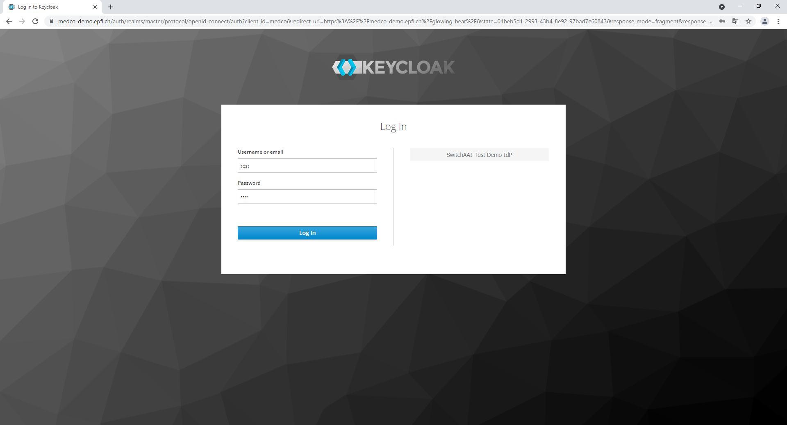

## A Simple Age Query

On the left side of the user interface is an ontology browser. The ontology browser enables you to explore the variables that might be contained in the database and to identify those that you would like to use for your query. Variables in the ontology browser are organized in a tree-like fashion and can be explored as a file system made of folders and files. Most of the time, variables and hierarchies are taken from standard medical terminologies and classifications. The purpose is to drag-and-drop criteria for cohort selection into the right-side panel called **inclusion criteria**.

1. In the MedCo Explore query parameters, select the option "**Selected groups occur in the same instance"**. It allows to manually specify dependencies between criteria. This option will be explained later.  
2. On the left sidebar, expand the ontology _SPHN-SPO ontology_, then the _Birth Datetime_ group, and then expand it to reveal _Birth Year-value_. Drag-and-drop this _Birth Year-value_ element to the right panel.

3. Below, an input field will appear: select _greater than_.  
4. Next to this field, type _1980_.

When you drag-and-drop an item, you can drop it in 3 different zones :

* The **Replace zone**, to change the element
* The **Or zone**, to create a Or condition with the new element
* The **And zone**, to create a And condition with the new element

5. So for the next step, on the left sidebar, expand the _Drug_ group, then the _Drug\_code_, and finally _ATC_. Drag-and-drop the _Nervous system drugs \(N\)_ element to the right panel in the **And zone**.

6. On the left sidebar, expand the _SPOConcepts_ group, then the _Somatic Variant Found_ group. Drag-and-drop the _Gene\_name_ element to the right panel in the **And zone**.  
7. An input field will appear: select _exactly matches._  
8. Next to this field, type _HRAS_.  
9. On the left sidebar, also in the _Somatic Variant Food_, drag-and-drop the _Hgvs\_c_ element to the right panel in the **And zone**.  
10. An input field will appear: select _contains_.  
11. Next to this field, type _6994_.

The **“Selected groups occur in the same instance”** option we selected before enabled a checkbox next to **each criterion**. All the checked boxes require to refer to the same observation. On the contrary, unticked boxes refer to independent observations.

In this case, we require that the mutation on the gene **HRAS** and the mutation at the position **6994** are the same object.  
  
12. So we need to uncheck the **Same instance** boxes for **Birth Year-value** and the **Nervous system drugs \(N\)** as the screenshot below. Indeed, these are distinct and independent objects from the **Somatic Variant Found** observation.

When all the Inclusion criteria have been added, the right panel should look like this :

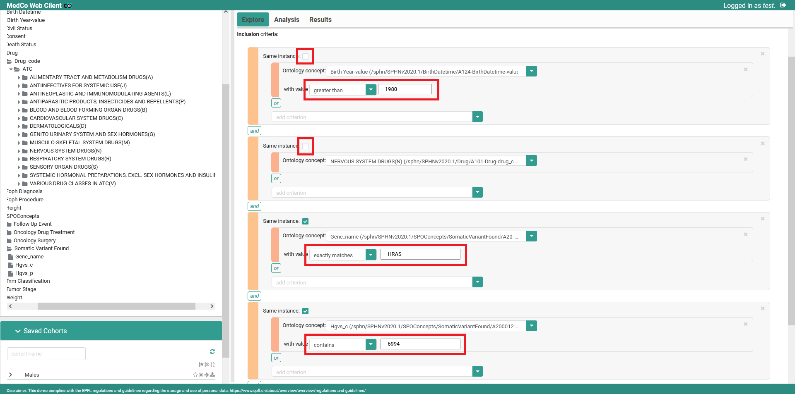

Now that we have selected the **Inclusion** criteria, we can add the **Exclusion** criteria :

1. On the left sidebar, expand the _Consent_ group, then _Status_. Drag-and-drop the _Refused_ element to the right panel in the **Exclusion** area. Uncheck the option **Same instance**.  
2. On the left sidebar, also in the _Consent_ group, extend the _Type_ group. Drag-and-drop the _Waiver_ element to the right panel in the **Exclusion**’s **Or zone**.

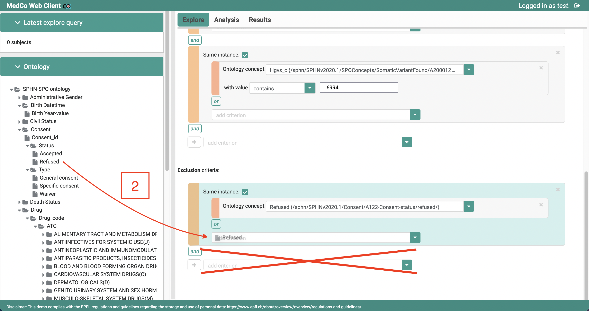

3. Click _Run_. After a few seconds of loading, the number of subjects will be displayed at the top.

## Survival Analysis

In this part, to have some subjects, we first need to build and run a Query, then we need to run some analyses on it. Finally, we can see the results of the analyses and change some visualization parameters.

1. Browse the ontology panel again to expand _SPHN-SPO_ ontology, then expand _SPOConcepts_. Drag-and-drop the _Oncology Drug Treatment_ element to the right panel in the **Inclusion** area.

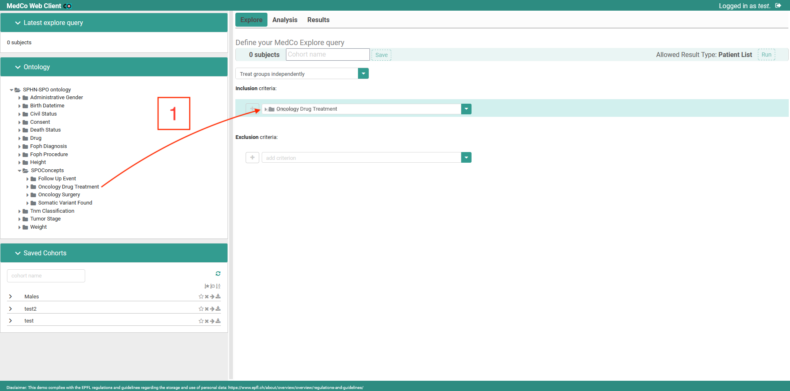

2. Click _Run_ at the top. After a few seconds of loading, the number of subjects will be displayed.  
3. Name the Cohort as _had\_treatment_ and click on **Save**. The Cohort will appear on the left panel, below **Saved Cohorts**.

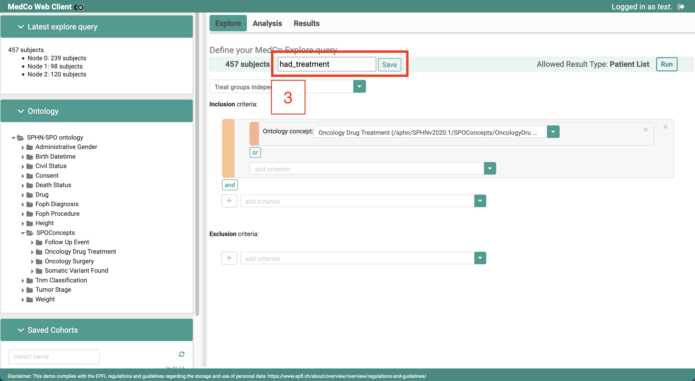

4. The Cohort is now saved, click on it to select it.

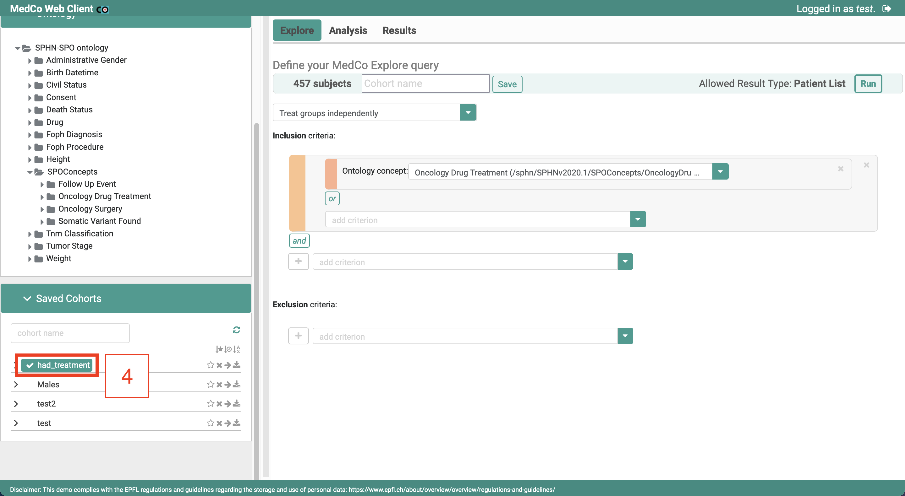

5. Click on the _Analysis_ tab at the top of the page, then on _Survival_.

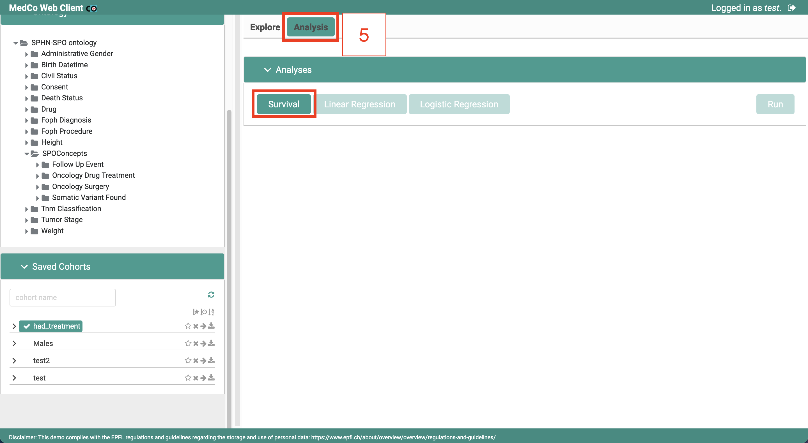

6. Open the _Settings_ panel and set a _Time Limit_ of **20 years**.

7. Drag-and-drop the _Oncology Drug Treatment_ element in the right panel under _Start Event_.

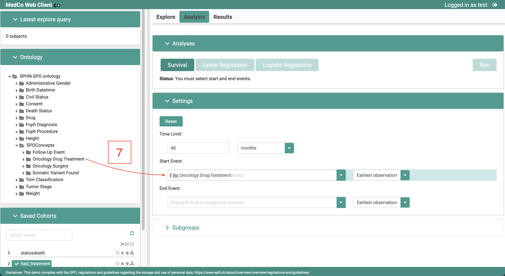

8. Browse the ontology panel again to expand _Death Status_, then expend _Status_. Drag-and-drop the _Death_ element to the right panel under _End Event_.

9. Open the _Subgroups_ panel and set the first subgroup name as **surgery**.

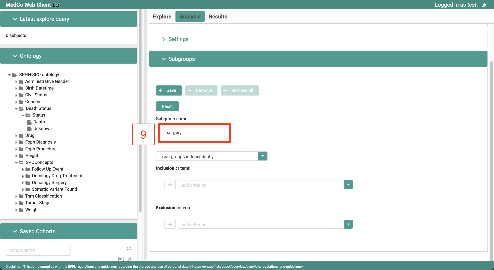

10. Drag-and-drop the _Oncology Surgery_ element in the right panel in the _Inclusion criteria_ area. Click on _Save_ to save the subgroup.

11. Set the second subgroup name to **no\_surgery**.  
12. Drag-and-drop the _Oncology Surgery_ element in the right panel in the _Exclusion criteria_ area. Click on _Save_ to save the subgroup.

13. Click on _Run_.

14. After a few seconds of loading, the result will be displayed. By opening the _Input parameters_ panel, you can find more details about the query.  
15. Click on the cog icon to open the panel to edit the _Confidence interval_ of the graphical representation. In this panel, you can change diverse parameters to alter the graphical representation. When you have finished, close this panel.

16. On the right side, you can also choose the tabular scores to show.

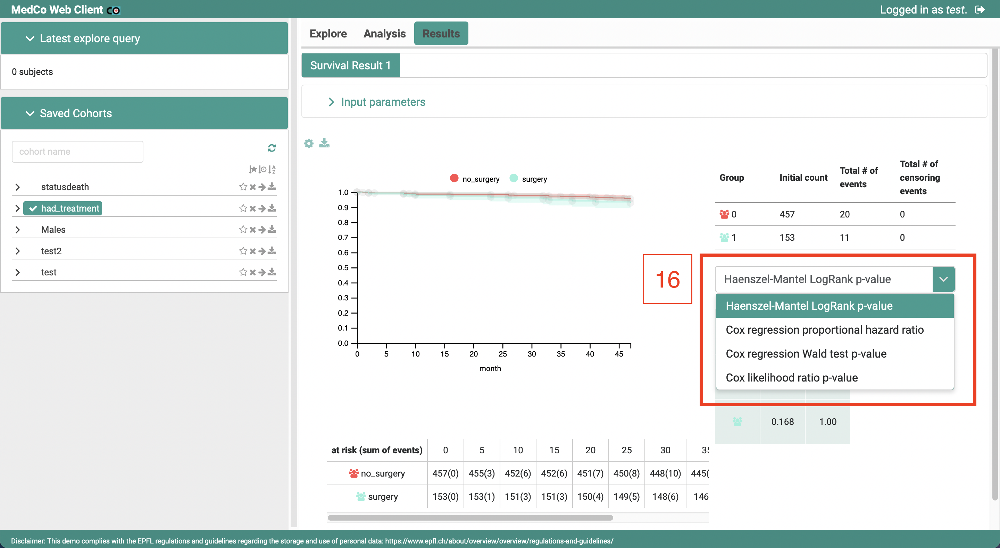

17. Finally, you can download the results in **PDF form** by clicking on the _download_ icon.

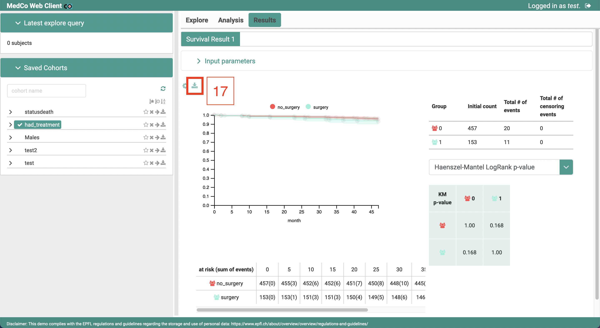

## Conclusion

Only a few exploration and analysis features available in Medco have been presented in this document; more are available, and all can be combined with no limitations. No adaptations were made to the data, except for the tabular vs. graph representation. In particular, no links were lost or tampered with. Every edge in the semantic graphs \(e.g., every relation between a patient and their diagnosis or treatment\) is preserved. The Medco database uses visit \(encounter\) identifiers, patient pseudo-identifiers, and instance \(observation\) identifiers; they are not shown to the user. Therefore, using Medco does not inherently add any usability penalty, compared to the original clinical data.

## References

\[1\] “Swiss personalized health network,” [https://sphn.ch/](https://sphn.ch/), accessed: 2021-02-26.

\[2\] “Data protection in personal health,” [https://dpph.ch/](https://dpph.ch/), accessed: 2021-02-26.

\[3\] [https://medco.epfl.ch/](https://medco.epfl.ch/), accessed: 2021-02-26.

\[4\] J. L. Raisaro, J. R. Troncoso-Pastoriza, M. Misbach, J. S. Sousa, S. Pradervand, E. Missiaglia, O. Michielin, B. Ford, and J.-P. Hubaux, “Medco: Enabling secure and privacy-preserving exploration of distributed clinical and genomic data,” IEEE/ACM transactions on computational biology and bioinformatics, vol. 16, no. 4, pp. 1328–1341, 2018.

